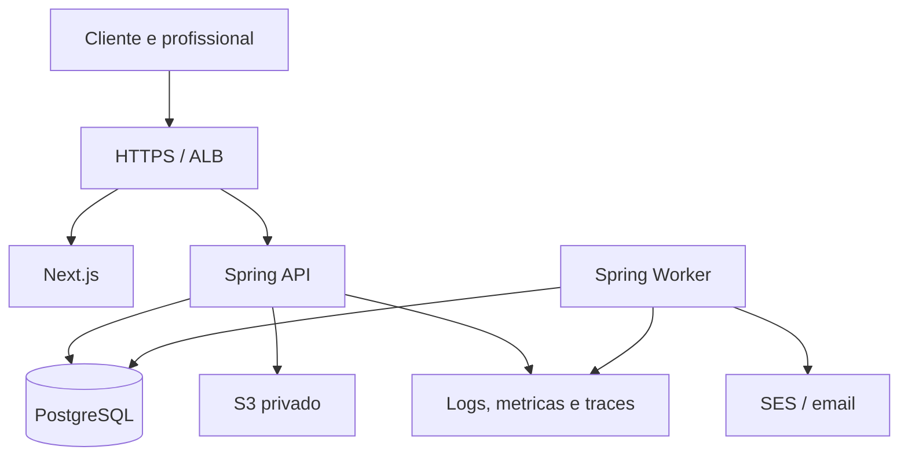

# Agendou - Arquitetura implementavel

## 1. Stack recomendada

| Area | Escolha |
|---|---|
| Backend | Java 21 LTS + Spring Boot |
| API | Spring MVC, Bean Validation, Spring Security |
| Persistencia | Spring Data JPA para CRUD e JDBC/SQL explicito para locks/alocacao |
| Banco | PostgreSQL 17+ com RLS, constraints e `btree_gist` |
| Migracoes | Flyway |
| Sessao | Spring Session JDBC |
| Frontend | Next.js, React, TypeScript |
| UI | Tailwind CSS, componentes acessiveis, React Hook Form, Zod |
| Calendario | FullCalendar Standard e lista mobile propria |
| Testes | JUnit, Testcontainers, React Testing Library, Playwright |
| Local | Docker Compose com PostgreSQL, Mailpit e S3 compativel |
| Producao | AWS ECS/Fargate, RDS PostgreSQL, S3, SES, CloudWatch |
| IaC | Terraform |
| CI/CD | GitHub Actions, ECR e OIDC para AWS |

## 2. Componentes



## 3. Estrutura de repositorio

```text
apps/
  api/
    pom.xml
    src/main/java/br/com/agendou/
    src/main/resources/db/migration/
  web/
    app/
    components/
    features/
    package.json
contracts/
  openapi.yaml
infra/
  local/compose.yaml
  terraform/
tests/
  e2e/
docs/
  adr/
  runbooks/
assets/
  agendou-logo.svg
```

## 4. Modulos backend

| Modulo | Responsabilidade |
|---|---|
| `identity` | usuario, autenticacao, sessoes, tokens e MFA super admin |
| `tenancy` | tenant, membership, contexto transacional e RLS |
| `billing` | planos, trial, assinatura, bloqueio e reativacao |
| `catalog` | perfil publico, logo, servicos e politica |
| `scheduling` | disponibilidade, slots, bloqueios e alocacoes |
| `customers` | contato verificado, acesso cliente e historico |
| `bookings` | ciclo da reserva e estados |
| `payments` | PIX manual, comprovante, conferencia, transacoes e devolucao |
| `notifications` | outbox, templates e emails essenciais |
| `platform` | super admin, suporte operacional e tenants |
| `audit` | trilha de auditoria e eventos relevantes |

Cada modulo deve separar API, aplicacao, dominio e persistencia apenas quando isso reduzir complexidade real.

## 5. Deploy inicial

- Um dominio com `/api/*` roteado para API e demais rotas para Next.js.
- API e worker usam a mesma imagem Java com perfis diferentes.
- Worker sem porta publica.
- RDS privado, S3 privado, Secrets Manager e SES autenticado.
- Homologacao e producao separados por dados, secrets, buckets e permissoes.
- Comecar com uma replica de API/web no piloto e registrar ponto unico de falha da aplicacao.

## 6. Pipeline

1. Pull request executa build Java, testes backend, Testcontainers, lint/typecheck web, testes frontend, validacao OpenAPI e Terraform validate.
2. Merge gera imagens imutaveis e publica no ECR.
3. Homologacao executa migrations, deploy e smoke/E2E criticos.
4. Producao promove o mesmo digest.
5. Rollback volta imagem compativel; migration destrutiva exige expand/contract.

## 7. Observabilidade minima

- Correlation ID em toda requisicao.
- Logs estruturados sem dados sensiveis.
- Metricas de latencia, erro, fila outbox, expiracao de trial, expiracao de reserva, bloqueios e confirmacoes.
- Alertas para falha de email, idade da outbox, erro 5xx, deadlocks, restore nao testado e tenants bloqueados por trial.
