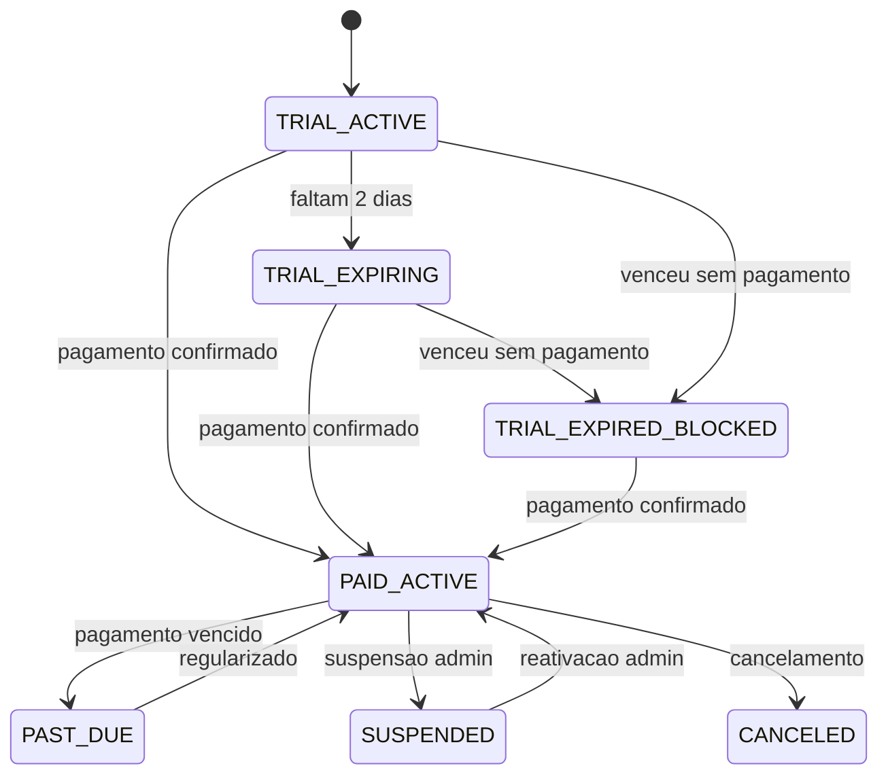
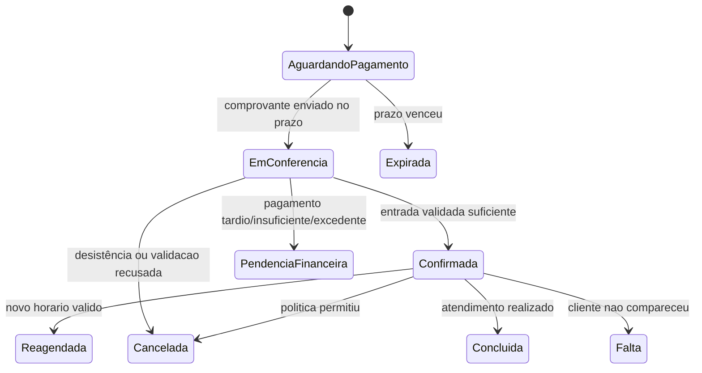

# Agendou - Modelo de dados e estados

## 1. Migracoes iniciais

| Migracao | Entidades | Regras principais |
|---|---|---|
| V001 | Tenant, User, Membership, PlatformRole, Session, AuthToken | Slug unico, token com hash, roles separadas. |
| V002 | Plan, Subscription, SubscriptionEvent, BillingDecision | Trial apenas Premium/Top, 7 dias, bloqueio e reativacao. |
| V003 | ProfessionalResource, PublicProfile, Service, PixReceiver | Uma agenda inicial, preco em centavos, entrada 50-100%. |
| V004 | AvailabilityRule, AvailabilityException, CalendarAllocation | UTC, fuso IANA, constraint GiST e bloqueios. |
| V005 | Customer, CustomerAccessToken, Booking, BookingEvent | Contato verificado, snapshots e historico. |
| V006 | UsageBucket, UsageEntry | Quota confirmada e provisoria por mes. |
| V007 | PaymentIntent, PaymentTransaction, PaymentEvidence, Refund | PIX manual, comprovante privado, referencia unica. |
| V008 | OutboxEvent, Notification, AuditLog | Deduplicacao, retries e auditoria. |

## 2. Entidades centrais

### Tenant

- `id`
- `slug`
- `display_name`
- `status`
- `created_at`
- `updated_at`

### Subscription

- `id`
- `tenant_id`
- `plan_code`
- `status`
- `trial_started_at`
- `trial_ends_at`
- `paid_until`
- `blocked_at`
- `reactivated_at`
- `cancelled_at`

### Service

- `id`
- `tenant_id`
- `name`
- `description`
- `duration_minutes`
- `price_cents`
- `deposit_percent`
- `buffer_before_minutes`
- `buffer_after_minutes`
- `active`

### Booking

- `id`
- `tenant_id`
- `customer_id`
- `service_id`
- `status`
- `starts_at_utc`
- `ends_at_utc`
- `expires_at_utc`
- `service_snapshot_json`
- `pix_snapshot_json`
- `price_cents`
- `deposit_due_cents`

### PaymentIntent

- `id`
- `tenant_id`
- `booking_id`
- `status`
- `amount_due_cents`
- `amount_validated_cents`
- `deadline_at_utc`
- `provider = MANUAL_PIX`

## 3. Estados de tenant/assinatura

## 4. Estados de reserva

## 5. Regras de integridade

- FKs de negocio usam `(tenant_id, id)` quando a entidade pertence ao tenant.
- RLS nega contexto ausente.
- Role da aplicacao nao e dona das tabelas e nao possui `BYPASSRLS`.
- `CalendarAllocation` impede sobreposicao ativa por tenant/recurso.
- `PaymentTransaction` possui unicidade de referencia bancaria por tenant/conta quando aplicavel.
- `SubscriptionEvent` e `AuditLog` sao append-only.
- Snapshots preservam preco, duracao, recebedor PIX e politica vigentes no momento da reserva.

## Migrations efetivamente implementadas

O quadro inicial acima é o plano de domínio. O histórico real até esta etapa é:

- V001: tenants, plans, subscriptions e subscription_events.
- V002: role de runtime separada e RLS forçada nas tabelas de negócio.
- V003: usuários, memberships, tokens, outbox SMTP, sessões JDBC, perfil inicial e constraints adicionais de assinatura/eventos.

As próximas migrations devem continuar a numeração existente, sem reutilizar versões do quadro planejado.
